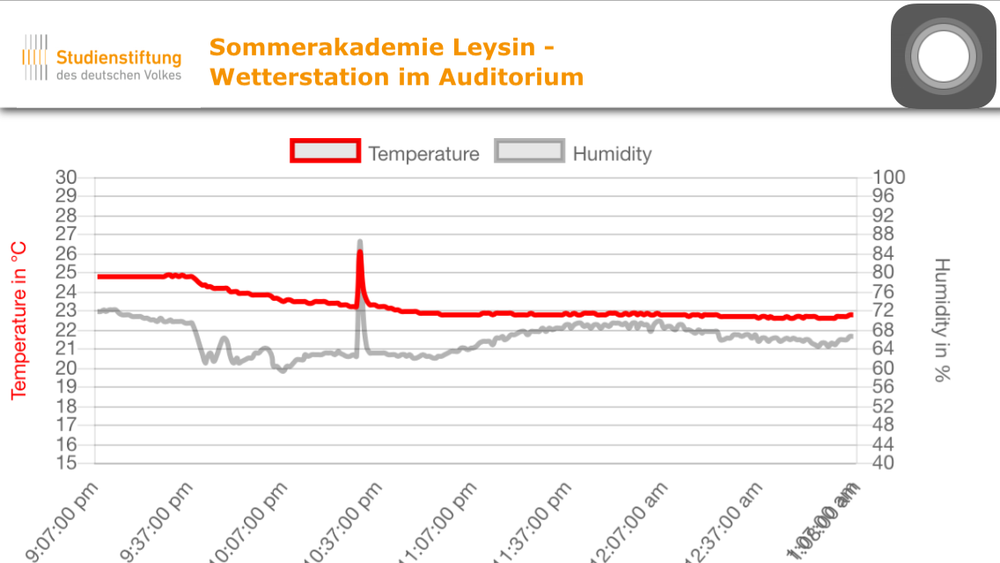
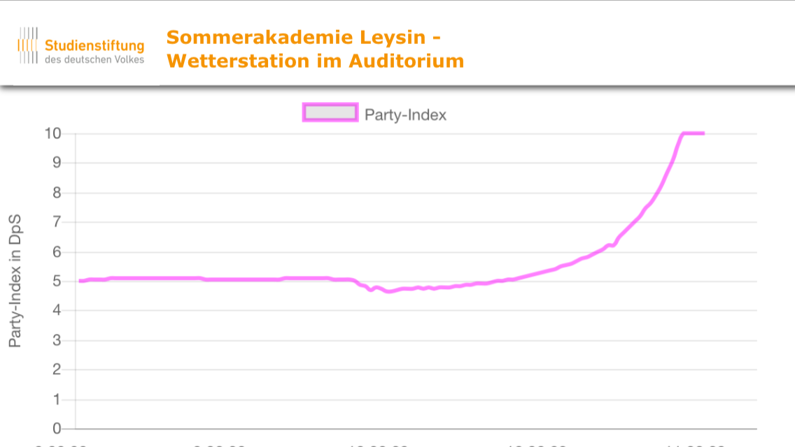

# NodeMCU-Sample

:cloud: The weather station sample using the NodeMCU and the Raspberry Pi 2.

Im Rahmen der AG2 - Effizientes Rechnen wurde im Auditorium unseres Seminarhauses eine "Wetterstation" aufgestellt. Diese besteht aus einem [ESP-8266-Microcontroller](http://www.ebay.de/itm/like/401054497731?lpid=106&chn=ps&ul_noapp=true), der die Sensoren auswertet und auf einem kleinen Webserver zur Verfügung stellt.

Auf einem kleinen selbstgeschriebenen Node.js Server auf einem Raspberry Pi 2 im Gruppenraum der AG wurde der Sensor im Auditorium mittels HTTP-Request übers WLAN jede Minute nach seinen Daten gefragt. Die Sensoreinheit misst neben der Raumtemperatur auch die Luftfeuchtigkeit, sowie den Luftdruck und die Lautstärke. Diese Informationen sollten bis zum Ende der Akademie aufgenommen und gespeichert werden. Daraus wurde ein Party-Index berechnet, um über die Webseite verfolgen zu können, wann Vorträge oder auch Parties dort unten stattfanden und wie sich diese auf das Raumklima auswirkten.

Die Sensorrohdaten im Browser:





## Inhalt

* [Teile](#Teile)
* [Sensoreinheit](#Sensor)
* [Einrichtung des ESP-8266](#ESP-Setup)
* [Einrichtung des Frontend Servers auf dem Raspberry Pi](#Einrichtung-des-Frontend-Servers-auf-dem-Raspberry-Pi)
 - [Installieren von externen Modulen](#Installieren-von-externen-Modulen)
    + [Express](#Express)
    + [Jade](#Jade)
 - [Struktur unseres Servers](#Struktur-unseres-Servers)
 - [Globale Variablen und Einstiegspunkt - config.JSON und index.js](#Globale-Variablen-und-Einstiegspunkt:-config.JSON-und-index.js)
 - [Sensordaten pollen und speichern - sensor.js](#Sensordaten-pollen-und-speichern:-sensor.js)
 - [Transformieren der Daten - transform.js](#Transformieren-der-Daten:-transform.js)
 - [Der Server - server.js](#Der-Server:-server.js)
* [Frontend Visualisierung](#Frontend-Visualisierung)
 - [Das wirkliche Front End - index.jade](#Das-wirkliche-Front-End:-index.jade)
 - [Die Graphen - chartmaker.js](#Die-Graphen:-chartmaker.js)
* [Starten des Servers](#Starten-des-Servers)

## Teile

Für die Wetterstation benötigt man folgende Teile:

- [ESP-8266-Microcontroller](http://www.ebay.de/itm/like/401054497731?lpid=106&chn=ps&ul_noapp=true)
- HDC-1000 Temperatur/Luftfeuchtigkeitssensor
- [SparkFun Sound Detector (LMV3234)](https://www.sparkfun.com/products/12642)
- BMP180 Barometer
- Raspberry Pi mit Raspbian und NodeJS
- Jumperkabel, Breadboard
- USB-Stromversorgung (für ESP-Microcontroller und den Raspberry)

## Sensor 

Die Sensoreinheit besteht aus dem ESP-8266 als Zentrale, der Temperatur-, Luftfeuchtigkeit- und Luftdrucksensor sind über den I2C-Bus daran angeschlossen, hier werden die Pins D2 und D3 verwendet. Das Sound Detector Modul wird über den analogen Eingang ausgelesen. Die genaue Verschaltung der Sensormodule mit dem NodeMCU-Board ist auf folgendem Fritzing-Diagramm erkennbar.

//

## ESP-Setup
Die Daten werden über ein Arduino-Skript auf dem ESP-8266 ausgelesen und auf diesem über einen kleinen Webserver zur Verfügung gestellt. Damit auch der ESP auch von der Arduino-IDE unterstützt wird, muss man ein Paket, den ESP 8266 Core, nachladen. Wie das geht kann man im [Github-Repository von der ESP8266 Community](https://github.com/esp8266/Arduino) nachlesen. Dann braucht nur noch das von dir verwendete Board in der IDE unter "Werkzeuge" ausgewählt werden, wir haben das NodeMCU (Basierend auf dem ESP-12E) verwendet. 

Der Code für die Sensor-Einheit ist HIER (LINK) zur Verfügung gestellt. Er ist leider weder schön noch gut nachvollziehbar, ist aber über mehrere Tage sehr stabil gelaufen. Für den Webserver wird die <ESP8266WiFi.h>- Bibliothek benutzt, zum Ansprechen des BMP180 und für das Handling des I2C-Bus werden zwei weitere Bibliotheken, <SFE_BMP180.h> und <Wire.h>, verwendet. 

## Einrichtung des Frontend Servers auf dem Raspberry Pi

### Installieren von externen Modulen

Um den Server auf dem Raspberry Pi (RasPi) zu realisieren brauchen wir einige externe Module. Zum einen `express`, welches eine unkomplizierte Realisierung des Servers auf Basis von NodeJS ermöglicht. Und zum anderen `jade`, um ohne großen Aufwand allerhand Variablen und Daten an die frontend Visualisierung zu übergeben (und uns nicht mit sperrigem html `<>` aufhalten zu müssen).

#### Express

Wir gehen hier davon aus, dass NodeJS bereits auf dem RasPi installiert ist (standardmäßig ist dies der Fall).

Wir erstellen nun ein neues Verzeichnis für unsere Frontend Dateien und wechseln in das Verzeichnis:

```bash
mkdir frontend
cd frontend
```

Nun erstellen wir mit dem Befehl `npm init` eine Datei namens *package.json*. Diese speichert Dinge wie Beschreibung, Autor, Einstiegspunkt, Abhängigkeiten, etc. für das Projekt.

```bash
npm init
```

Nun werden nacheinander alle Optionen für *package.json* abgefragt - hier kann man die defaults mit Enter bestätigen oder neue Daten eingeben. Wichtig ist nur, dass der Eintrag `entry point: (index.js)` unverändert bleibt, da dies den Einstieg in unser Programm definiert

```plain
entry point: (index.js)
```

Nun können wir express installieren:

```bash
npm install express --save
```

(Node-Module, die mit der Option `--save` installiert werden, werden zur Abhängigkeitsliste in der Datei package.json hinzugefügt. Danach werden bei der Ausführung von npm install im Verzeichnis frontend automatisch alle Module in der Abhängigkeitsliste installiert.)

Bei Problemen gibt es [hier mehr Infos zu express](http://expressjs.com/en/starter/installing.html).

#### Jade

Die Installation von Jade ist relativ simpel:

```bash
npm install jade --save
```

Voilá, nun ist alles nötige vorinstalliert - wir können also mit der Programmierung des Servers beginnen.

### Struktur unseres Servers

Bevor wir jedoch in die Untiefen des Codes einsteigen vergegenwärtigen wir uns noch einmal den Aufbau des Projekts. Unser Sensorboard liefert uns als Antwort auf eine einfache http-Request ein JSON-Objekt mit den Daten aller Sensoren zum Zeitpunkt der Request. Diese Daten möchten wir in regelmäßigen Abständen pollen und in eine Datei speichern. So bauen wir uns unseren Datensatz auf.

Unabhängig davon möchten wir auf eine http-Request eines Endnutzers eine Website bereitstellen, die die Daten der letzten Stunden (oder Tage) als Graphen ausgibt.

Wir müssen also zum Einen ständig Daten pollen und speichern und zum Anderen mit Hilfe eines Servers auf eine http-Request mit einer schönen html Seite antworten. Let's do it!

### Globale Variablen und Einstiegspunkt: config.json und index.js

Um einige Grundlegende Variablen an einem Punkt zu speichern und dadurch Änderungen relativ schmerzlos zu machen erstellen wir zu Beginn eine JSON Datei namens *config.json* (der Name spielt keine Rolle, aber sprechende Namen sind guter Stil). Wir füllen Sie mit folgendem Inhalt:

```json
{
  "db": "./wetterstation_daten.txt",
  "sensor": {
    "host": "192.168.10.217",
    "path": "/raw",
    "refresh": 60
  },
  "server": {
    "port": 3000,
    "displayedHours": 4,
    "assets": "assets/"
  }
}
```

Wir definieren hier ein JSON-Objekt mit drei Attributen: "db", "sensor", "server":

- "db" bekommt den Pfad zur Datei, die die Sensordaten enthalten wird.
- "sensor" ist wiederum ein JSON-Objekt in dem wir die Daten der Sensoreinheit definieren (IP-Adresse und path für die Daten-polls und "refresh" speichert das Intervall in dem wir neue Daten pollen in Sekunden)
- "server" speichert einige Daten zu unserem Server - "displayedHours" ist die Zeitspanne an Daten, die in den Graphen angezeigt werden soll
- "assets" definiert den Pfad zu unseren Assets (Bilder, CSS, die Chartmaker Ressourcen für die Graphen)

Mehr brauchen wir nicht an grundlegenden Infos in *config.json*.

Der Einstiegspunkt für den Server ist, wie oben bei der Installation von `express` definiert *index.js*.

Wir erstellen also eine Datei *index.js*. Der Quellcode ist relativ simpel:

```js
var fs = require('fs');
var sensor = require('./sensor.js');
var server = require('./server.js');
var config = JSON.parse(fs.readFileSync('config.json', 'utf8'));
```

Mit Hilfe der require Anweisungen binden wir Module in unsere Datei ein. `fs` ist ein Standardmodul, das zum Lesen und schreiben von Dateien benötigt wird. *sensor.js* und *server.js* sind beides Module, die wir uns selbst bauen werden und *config.json* beinhaltet unsere config Daten, wie gerade besprochen.

Nun starten wir die Routine, die alle 60 Sekunden (wie in *config.json* festgelegt - weshalb wir der Funktion config als Argument übergeben) die Daten vom Sensor abfragt und abspeichert.

```js
sensor.poll(config);
```

Nun starten wir den eigentlichen Server und übergeben ihm die config Daten, sowie das Modul sensor. Dieses braucht er um die sich die Datensätze holen zu können.

```js
server.start(config, sensor);
```

Damit ist *index.js* auch schon fertig. Der Einstiegspunkt für unser Projekt ist definiert, doch die eigentliche Arbeit beginnt erst jetzt.
	
### Sensordaten pollen und speichern: sensor.js

Zunächst definieren wir das Polling der Sensordaten vom Sensorboard und bieten gleichzeitig eine Schnittstelle für den Server diese Daten zu lesen.

Dazu erstellen wir die Datei *sensor.js*. Zunächst binden wir die nötigen Module ein, um http Requests schicken zu können und mit Dateien zu arbeiten. Außerdem legen wir eine Variable für unsere Daten an, diese ist zunächst natürlich leer.

```js
var http = require('http');
var fs = require ('fs');
var data = [];
```

Wir stellen nun mit `module.exports` die Funktionalitäten nach außen bereit, die wir später im Server brauchen. (Wir definieren uns hier eine Schnittstelle. Wird sensor.js in einer anderen Datei per require('/sensor.js') eingebunden sind nur die Funktionen, die wir jetzt definieren benutzbar bzw. sichtbar.)

Zunächst stellen wir die Daten zur Verfügung:

```js
module.exports = {
  getData: function () {
    return data;
},
```

Nun definieren wir die poll-Routine, die die Daten vom Sensor beschafft und abspeichert:

```js
  poll: function (config) {
```
			 
Zunächst definieren wir einige Variablen. `filename` bekommt den Pfad zur Datei mit den Daten und `options` ist ein Objekt mit der IP-Adresse des Sensors und dem Pfad auf dem Sensor zu den Daten. Wir definieren dies in der Form, da die http-request Funktion dies so will (sh. weiter unten). (Man beachte, wie wir auf die Daten aus der übergebenen config-Datei zugreifen)

```js
  var filename = config.db;
  var options = {
    host: config.sensor.host,
    path: config.sensor.path
  };
``` 
		
Falls bereits eine Datei mit Sensordaten besteht lesen wir diese in unsere data Variable komplett ein. So steht uns der gesamte Datensatz zur Verfügung. (Da in der Datei JSON-Objekte im Stringformat gespeichert sind, müssen wir diese per `JSON.parse()` zurück in JSON-Objekte wandeln. Außerdem geben wir auf die Konsole aus, dass das restoring erfolgreich war.)

```js
  if (fs.existsSync(filename)){
    data = JSON.parse( fs.readFileSync(filename,'utf8'));
    console.log('Restored %s entries.', data.length);
  }
```

Nun definieren wir die callback Routine, die die http-Response des Sensors verarbeiten wird. Diese Funktion übergeben wir weiter unten der http-Request, damit sie ausgeführt wird, sobal die response ankommt.

```js
    callback = function (res) {
      var str = '';
```

`str` wird die Response als String speichern. Denn wir wissen, dass der Sensor uns ein JSON-Objekt als String liefert, welches wir später über `JSON.parse()` wieder umwandeln und dann weiterverwenden können.
Das Argument `res` ist unsere http-Response. Diese kommt in Paketen an, d.h. wir müssen diese Pakete verarbeiten, solange welche ankommen:

```js
      res.on('data', function (chunk) {
        str += chunk;
      });
```

Sobald keine Pakete mehr ankommen haben wir einen Sensor-Datensatz vom Sensor in der Variable `str` gespeichert. Wir parsen sie ins JSON Format, fügen dem Datensatz die aktuelle Zeit hinzu und fügen ihn dann zu den bereits bestehenden Datensätzen hinzu:
			
```js
      res.on('end', function () {
        var obj = JSON.parse(str);
        obj.Time = new Date().toJSON();
        data.push(obj);
```

Jetzt speichern wir noch alle Daten zurück in die Datei und haben dadurch den neuen Datensatz zu unserer "Datenbank" hinzugefügt:

```js
        fs.writeFile(filename, JSON.stringify(data), function() {
          console.log('Data saved!');
        });
      });
    }
```

Wir sind jetzt mit der callback Funktion fertig und können nun die eigentliche Poll Funktion definieren. Damit diese periodisch ausgeführt wird, betten wir sie in einen `setInterval()` ein:

```js
    setInterval(function () { 
      var req = http.request(options, callback);

      req.on('error', function () {
        console.log('Sensor is down, trying to reestablish connection ...');
      });

      req.end();
    }, config.refresh * 1000);
  },
};
```

Wir starten die http request an den sensor (dank unserer oben definierten options Variable sehr schön lesbar). Diese ruft unsere callback Funktion auf, wenn alles funktioniert. Falls der Sensor jedoch nicht online ist oder aus einem sonstigen Grund keine Daten schickt geben wir dies auf die Konsole aus.

Die Request muss in beiden Fällen beendet werden und dann wird das ganze nach der `config.refresh` - Zeit wider ausgeführt.

Nun erklärt sich auch, warum wir in *index.js* nur einmal `sensor.poll(config);` aufrufen - das `setInterval()` hier muss nur einmal aufgerufen werden und wird dann bis zum Beenden des ganzen Programms immer wieder ausgeführt. Wir bauen nun also kontinuierlich unseren Datensatz auf und können nun damit beginnen ihn interessierten Menschen im Internet zu zeigen. :)

### Transformieren der Daten: transform.js

Bevor wir den eigentlichen Server bauen müssen wir noch kurz dafür sorgen, dass wir die Sensordaten so aufbereiten, dass die Graphen sie auch richtig anzeigen. Dazu erstellen wir das Modul *transform.js*, welches uns eine Reihe an Funktionen bereitstellt, die wir dann im eigentlich server verwenden werden um die Rohdaten zu transformieren und ans frontend zu übergeben.

Wir erstellen also eine Datei *transform.js* und definieren wieder mit `module.exports` die Funktionen die wir bereitstellen. Diese Funktionen sind alle relativ selbsterklärend. Wir bekommen ein item übergeben - dieses Item ist ein Datensatz mit allen Sensordaten im JSON-Format. Wir geben von diesem Datensatz nun als x- und y-Koordinaten für die Graphen die Zeit und den Wert der jeweiligen Größe, die uns interessiert zurück:

```js
var smoothingTime = 5;

module.exports = {
  temperature: function (item) {
    return {
      x: item.Time,
      y: item.TemperatureHDC
    };
  },
  amplitude: function (item) {
    return {
      x: item.Time,
      y: item.Amplitude
    };
  },
  humidity: function (item) {
    return {
      x: item.Time,
      y: item.Humidity
    };
  },
  pressure: function (item) {
    return {
      x: item.Time,
      y: item.RelPressure
    };
  },
```


Für den Partyindex müssen wir mehrere Werte zusammenrechnen, bzw. gewichten - damit die Lautstärke ihnnicht zu zackig aussehen lässt mitteln wir sie immer über die letzten 5 Minuten vom jeweiligen Item aus gesehen. Am Ende returnen wir wieder ein Objekt mit einer x-Koordinate (Zeitpunkt des Items) und dem Party-Index als y-Koordinate.

Hier ist allerdings wirklich die Kreativität des Umsetzers gefragt einen besseren Algorithmus als unseren zu finden ;)

```js
  party: function (item) {
    var smoothFilter = new Date(item.Time);
    smoothFilter.setMinutes(smoothFilter.getMinutes() - smoothingTime);
    var data = sensor.getData();
    var last5MinutesAMP = data.filter(onlyRecentItems(smoothFilter));
    var acc = 0;
  
    for(var i = 0; i < last5MinutesAMP.length; i++){
      acc += last5MinutesAMP[i].Amplitude;
    }
    
    var smoothAmplitude = acc / last5MinutesAMP.length;
  
    if (smoothAmplitude <= 10) {
      return {
        x: item.Time,
        y: 0
      };
    } else if (smoothAmplitude >= 300) {
      return {
        x: item.Time,
        y: 10
      };
    } else {
      var partyIndex = (item.Humidity - 50 + item.Amplitude + (item.TemperatureHDC - 20) * 5) / 27;
  
      if (partyIndex > 10) {
        partyIndex = 10;
      }
      
      return {
        x: item.Time,
        y: partyIndex
      };
    }
    }
  },
};
```

Wir können nun also mithilfe dieser Transforms aus unserem großen Datensatz spezifisch einzelne Eigenschaften wie Temperatur oder Lautstärke oder ähnliches herausfiltern und bekommen sie in dem Format zurück, dass die Graphen brauchen um die Daten anzeigen zu können. Nun können wir tatsächlich damit anfangen den eigentlichen Server zu bauen. Endlich... ;)

### Der Server: server.js

Sinn des Servers ist es nach Requests aus dem Internet zu horchen und daraufhin eine Seite zu rendern, die die Daten, die wir sammeln hübsch darstellt. Ums hübsch darstellen kümmern wir uns später. Aber die request beantworten und alle Daten bereitstellen müssen wir über den Server.

Wir erstellen dazu eine Datei *server.js*. Zunächst binden wir express die transform Routinen ein, die wir gerade in *transform.js* definiert hatten:

```js
var express = require('express');
var transform = require('./transform.js');
```

Außerdem erstellen wir einen Puffer. In diesen speichern wir Datensätze, die bei einer Abfrage aus der Datenbank geladen werden, damit wir diese bei nachfolgenden Abfragen nicht wieder laden und transformieren müssen, da dies zu sehr langen Ladezeiten führen würde.
			
```js
var buffer = {
  lastLength: 0,
  value: undefined
};
```
		
Des Weiteren brauchen wir eine filter-Funktion, sodass nur die Datensätze zurückgegeben werden, die innerhalb der Zeitspanne liegen, die wir in *config.json* definiert haben. 

```js
function onlyRecentItems (hours) {
  var filterTime = new Date();
  filterTime.setMinutes(filterTime.getMinutes() - hours * 60);

  return function (item) {
    return new Date(item.Time) > filterTime;
  }
}
```

Wir geben hier eine Funktion zurück, die einen Wert bekommt (ein einzelner Datensatz aus der Datenbank) und `true` zurückgibt, falls der Wert jünger ist als die `filterTime` (also innerhalb der Zeitspanne liegt, die in config.json definiert ist). Dies müssen wir so machen, da die Standardfunktion `filter()` eine Funktion erwartet, die entweder `true` oder `false` zurückgibt. Wer filter noch nicht kennt [liest sich am besten hier](http://www.w3schools.com/jsref/jsref_filter.asp) kurz die Funktionsweise durch.

Nun definieren wir wieder unsere Modulschnittstellen. Dieses mal ist das nur eine einzige Funktion: `start(config, sensor)`. Diese haben wir ja schon in *index.js* aufgerufen, d.h. wir wissen ungefähr was sie machen soll. Sie startet unseren Server, der daraufhin auf requests wartet und bei einer request die Daten zurückschickt (mit ein wenig Extras damits gut aussieht).

```js
module.exports = {
  start: function (config, sensor) {
    var app = express();
    app.set('view engine', 'jade');
    app.use(express.static(__dirname + '/' + config.server.assets));
```
			    
Wir legen unser Server Grundgerüst mit Hilfe von `app = express()` Dadurch machen wir alle Funktionalitäten, die die netten Entwickler von express.js bereitgestellt haben verfügbar.

Mit `app.set` sagen wir dem Server, dass wir zum Rendern der Response Jade verwenden wollen. Genauere Erklärung folgt weiter unten.

Und mit `app.use` erklären wir dem Server, wo er seine Assets findet (CSS, Bilder und die Graphenerzeuger). (Man beachte auch hier wieder, wie wir den Pfad zu den assets aus der config Datei holen.)

Nun definieren wir was passiert, wenn ein bestimmter Pfad angefordert wird. Um dies besser zu verstehen machen wir einen kleinen Exkurs und reden über First Load Time und Aufmerksamkeitsspanne und User Experience. 

Eine Website sollte möglichst schnell laden, damit der Besucher nicht frustriert wird bevor er überhaupt die Inhalte der Seite sieht. Jetzt haben wir nur leider das Problem, dass wir schon für vier Stunden Graphanzeigen 240 Datensätze pro Sensorgröße übertragen müssen. D.h. für Temperatur, Feuchtigkeit, Lautstärke und Party-Index sind das schon 960 Datensätze. Das ist eine ganze Menge Holz und wird wahrscheinlich einige Sekunden dauern.

Die Seite sollte aber schneller laden - und das ist auch möglich, da wir ja neben den Daten der Graphen noch einen Header und einen Einleitungstext haben. D.h. wir spalten unsere Antwort auf eine Request in zwei Teile auf. Zuerst schicken wir nur ein plain HTML Dokument ohne Datensätze, das schnell lädt. In diesem Dokument lassen wir allerdings ein Skript laufen, dass sofort damit beginnt die eigentlichen Daten in die Graphen zu laden.

Der Vorteil hierbei ist, dass der Besucher der Seite sofort eine Seite mit Text und Logo und Farben sieht und im Idealfall solange mit Lesen beschäftigt ist, dass die Daten dann in den Graphen angekommen sind, wenn er fertig gelesen hat und sich die Graphen ansehen will.
			    
Wir definieren nun also zwei Endpunkte an denen der Server nach Requests lauscht. Der Hauptpfad `/` ist derjenige, den der normale Besucher requestet, wenn er von außen unsere Seit aufruft. Der Pfad `/weather` wird dann nur von dem Skript auf der Hauptseite benutzt, um die Datensätze nach zu laden. Pretty cool, eh ;) (Vielen Dank an Florian Rappl für diese Idee und deren Umsetzung!)

Zuerst definieren wir das nachladen der Datensätze:

```js
    app.get('/weather', function (req, res) {
      var data = sensor.getData();
    
      if (data.length !== buffer.lastLength || !buffer.value) {
        var filteredData = data.filter(onlyRecentItems(config.server.displayedHours));
        buffer.lastLength = data.length;
        buffer.value = {
          temperature: filteredData.map(transform.temperature),
          humidity: filteredData.map(transform.humidity),
          pressure: filteredData.map(transform.pressure),
          sound: filteredData.map(transform.amplitude),
          party: filteredData.map(transform.party)
        };
      }
    
      res.header('Access-Control-Allow-Origin', '*');
      res.json(buffer.value);
    });
```

Für den Fall, dass die Datenbank mehr Einträge hat als unser Puffer, oder wenn der Puffer leer ist holen wir uns von den Gesamtdaten diejenigen, die in der `config.server.displayedhours` Zeitspane liegen (mitHilfe von `filter()` und unserer oben definierten filter Funktion). Wir aktualisieren die Länge des Puffers und speichern in sein value Feld die Datensätze der einzelenen Größen (transformiert mit Hilfe unserer Funktionen aus *transform.js* gemapped auf die gefilterten Datensätze).

Die response schickt dann einen header und die Werte aus dem Puffer. Diese können wir dann in den Graphen anzeigen.

Nun definieren wir noch die Antwort auf einen normale Besucheranfrage auf das root-Verzeichnis.			    
			    
```js
    app.get('/', function (req, res) {
      res.render('index', { 
        scripts: ['js/Chart.bundle.min.js', 'js/chartMaker.js'],
        styles: ['css/style.css'],
        title: 'Sommerakademie Leysin - Wetterstation im Auditorium', 
      });
    });
```

Die Antwort soll aus dem *index.jade* File gerendert werden, welches wir noch erstellen. Da wir oben den View Engine auf Jade gesetzt haben weiß der Server, dass er mit render ein *.jade* File rendern soll. Es wird im Endeffekt ein einfaches HTML Dokument an den Nutzer gesendet. Allerdings können wir dem Renderengine noch alle Skripte, Stylesheets und den Titel übergeben.

Nachdem wir definiert haben, wie der Server auf alle Anfragen reagieren soll müssen wir ihn nun noch starten. Mit `app.listen()` tun wir dies. Dazu müssen wir ihm nur den in unserer config-Datei definierten Port übergeben. Die callback Funktion ist hier nur dazu da auf der Konsole auszugeben, dass der Server wirklich gestartet ist und am richtigen Port lauscht.

```js
    var server = app.listen(config.server.port, function () {
      var host = server.address().address;
      var port = server.address().port;
      console.log("App listening at http://%s:%s", host, port);
    });
    return server;
  }
};
```

Am Ende geben wir noch den Server zurück und voilá das Skellett unseres Frontends steht.

Wir haben nun also in *index.js*  die Sensor Polls gestartet (*sensor.js*), wodurch jede Minute Daten vom Sensor geholt werden und in unsere "Datenbank" Datei gespeichert werden. Gleichzeitig haben wir den Server gestartet (`server.start(...)`) und gerade in *server.js* definiert wo er lauschen soll und wie er auf verschiedene requests reagiert. Einmal die normale Nutzer request und einmal unsere Request an `/weather` um die Daten nach zu laden. 

Das heißt jetzt müssen wir uns noch ein *.jade* template bauen, damit auch wirklich eine html Seite gerendert werden kann. Und dann müssen wir noch dafür sorgen, dass die Daten auch wirklich als Graphen dargestellt werden. Let's go!

## Frontend Visualisierung

### Das wirkliche Front End: index.jade

Der Jade Render Engine erwartet, dass alle template Files in einem Ordner mit Namen "views" gespeichert sind. D.h wir erstellen in unserem Verzeichnis (in dem inzwischen folgende Dateien liegen sollten: *index.js*, *server.js*, *sensor.js*, *config.json*, *package.json* und *transform.js*) ein Unterverzeichnis "views" und wechseln auch gleich in dieses.

```bash
mkdir views
cd views
```

In dem Verzeichnis erstellen wir eine Datei namens *index.jade*.

Dies ist unser Template, das der Server rendert und dann als Antwort an den Besucher schickt. Hier definieren wir also, was wir dem Besucher tatsächlich zeigen.

Kurzer Exkurs über die Jade-Syntax:

Jade ist eine Mischung auf Markup und Programmiersprache und erleichtert uns die HTML-Syntax um einiges. Keine `<>` Klammern für Tags sondern Unterteilungen über Whitespace (also Tabs und Leerzeichen!). [Ein cooles Tutorial findet ihr hier.](http://cssdeck.com/labs/learning-the-jade-templating-engine-syntax)

Außerdem können wir auf die Variablen zugreifen, die wir dem Render Engine übergeben haben. Zur Erinnerung:
				
```js
res.render('index', { 
    scripts: ['js/Chart.bundle.min.js', 'js/chartMaker.js'],
    styles: ['css/style.css'],
    title: 'Sommerakademie Leysin - Wetterstation im Auditorium', 
});
```

Wir haben also `scripts`, `styles` und `title` zur Verfügung.

Unsere Seite sieht folgendermaßen aus - aber der Inhalt ist eigentlich irrelevant. Die wichtigen Elemente zum Einbinden der Graphen erkläre ich gleich.

```jade
doctype html
html
  head
    meta(name="charset", value="utf-8")
    title= title
    meta(name="viewport", content="width=device-width", initial-scale="1.0")
    - each s in styles
      link(href=s, rel='stylesheet')
  body
    header
      img(id='logo', src='/../images/Logo_stusti.jpg')
      h4(id="SiteTitle", fontcolor="red")!= title
    #main            
      #description
        p="Hier seht ihr die aktuellen Wetterbedingungen im schönen Auditorium des Swiss Alpine Center in Leysin. Gesponsort wird diese Seite von der AG2 - Effizientes Rechnen. Sie läuft auf einem kleinen selbstgeschriebenen Node.js Server auf einem Raspberry Pi im Gruppenraum der AG und fragt den Sensor im Auditorium mittels HTTP-Request übers WLAN jede Minute nach seinen Daten. Der Sensor misst neben der Raumtemperatur auch die Luftfeuchtigkeit, sowie den Luftdruck. Diese Informationen sollen bis zum Ende der Akademie aufgenommen werden, in der Hoffnung am bunten Abend anhand der \"Wetterdaten\” des Auditoriums zu sehen, wann Vorträge oder auch Parties dort unten stattfanden und wie sich diese auf das Raumklima auswirkten."        
        #charts           
          canvas#partyIndexChart.chart
          canvas#humidityTemperatureChart.chart
          canvas#barometerChart.chart
        footer
          p="Entwickler: Rene Burger, Fabian Wildgrube | AG2 - Green IoT"
    - each s in scripts
      script(src=s)
```

Interessant sind nur die letzten paar Zeilen. Damit die Graphen richtig angezeigt werden können müssen wir für jeden Graphen einen Canvas Objekt erstellen. Mit `#.....` definieren wir die DOM ID des Canvas. Darauf können wir dann im Skript, das die Daten in die Graphen lädt, zugreifen.

Mit dem 
			
```jade
- each s in scripts
      script(src=s)
```

Importieren wir alle Javascript Dateien die wir im Server der Variablen `script` zugewiesen haben. Und zu diesen beiden kommen wir jetzt auch schon.

### Die Graphen: chartmaker.js

Jetzt kommen wir zu den Graphen. Um diese zu realisieren benutzen wir die Bibliothek `chart.js` mit deren Hilfe man wunderschöne Graphen zaubern (lassen) kann. 

Zuerst wollen wir jedoch noch ein wenig Ordnung schaffen. Im Hauptverzeichnis unseres Projekts legen wir einen Ordner "assets" an. Diesre wurde schon oben erwähnt - in ihm legen wir unser Bilder und CSS Files und eben unsere JS Skripts für die Graphen.

Wir tun also folgendes:

```bash
mkdir assets
cd assets
mkdir JS
mkdir CSS
mkdir images
```

Unsere Ordnerstruktur sollte jetzt so aussehen:

```
/	
  assets
    JS
    CSS
    images
  views
    index.jade
  sensor.js
  server.js
  transform.js
  package.json
  config.json
  index.js
```

In den Ordner CSS legen wir unsere Stylesheets für das *.jade* Template ab. Darauf wird hier nicht näher eingegangen.

Im Ordner images liegen unsere Bilder (Logo, etc.).

Interessant wird der Ordner JS. Wir navigieren dorthin:
		
```
cd JS
```

Zuerst müssen wir jetzt [Chart.bundle.min.js](https://github.com/chartjs/Chart.js/releases/tag/v2.3.0) herunterladen und in diesem Verzeichnis (JS) speichern. 

Es sollte nur eine *.js* Datei sein: *Chart.bundle.min.js* (wer aufmerksam mitgelesen hat wird merken, dass wir diese Datei schon im Server an den Jade Render Enginge übergeben haben und in *index.jade* über die script Variable eingebunden haben).

Nun erstellen wir die eigentlichen Graphen. Dazu erstellen wir eine Datei *chartMaker.js*.

Diese soll periodisch ab dem Laden der Seite über unseren `/weather` Endpunkt vom Server die Daten des Sensors abrufen und darstellen. Hierzu definieren wir zuerst eine request Methode, die eine Anfrage an den Server schickt.

```js
function request (url, callback) {
  var request = new XMLHttpRequest();
  request.onreadystatechange = function () {
    var DONE = this.DONE || 4;
    if (this.readyState === DONE) {
      callback(JSON.parse(this.responseText));
    }
  };
  request.open('GET', url, true);
  request.send(null); 
}
```

`callback` ist hierbei eine Funktion, die wir gleich definieren. Man beachte, dass wir den Antworttext (`this.responseText`) als JSON-Objekt an die Callback Funktion übergeben. 
Wenn wir uns erinnern - bei Anfrange an `/weather` gibt der Server uns folgendes zurück:

```js
buffer.value = {
  temperature: filteredData.map(transform.temperature),
  humidity: filteredData.map(transform.humidity),
  pressure: filteredData.map(transform.pressure),
  sound: filteredData.map(transform.amplitude),
  party: filteredData.map(transform.party)
};
```

Wir bekommen also hier die Datensätze und können sie nun ganz einfach über `xyz.party` oder `xyz.temperature`, etc. abrufen.

Mit diesem Wissen schreiben wir jetzt die Routine für das nachladen der Daten in die Charts:

```js
function refreshCharts() {
  request('/weather', function (obj) {
```

Wir rufen direkt das grade definierte request auf mit dem Ziel `/weather` und definieren eine anonyme Funktion als Callback. Diese bekommt die Antwort (`obj`) als Argument und kann dann damit arbeiten (also per obj.party bekommen wir den Datensatz der Partyindices).

Jetzt definieren wir uns einen Graph, in dem wir einen neuen Chart erstellen, der als Konstruktorargument den Canvas braucht in den er gezeichnet werden soll (die canvas Elemente, die wir in *index.jade* erstellt haben). Zur genauen [Dokumentation der Graphen von Chart.js geht es hier](http://www.chartjs.org/docs/). 

```js
  var PartyChart = new Chart(document.querySelector("#partyIndexChart"), {
    type: 'line',
    data: {
      datasets: [
        {
          label: 'Party-Index',
          data: obj.party,
          fill: false,
          borderWidth: 3,
          borderColor: 'rgba(255,0,255,0.5)',
          pointRadius: 0
        }
      ]
    },
    options: {
      responsive: true,
      maintainAspectRatio: true,
      scales: {
        xAxes: [{
          type: 'time',
          unit: 'day',
          time: {
            displayFormats: {
               'day': 'MMM DD'
            }
          },
          gridLines: {
            display: false
          }
        }],
        yAxes: [
          {
            scaleLine: {
              display: false
            },
            gridLines: {
              display: true,
            },
            ticks: {
              max: 10,
              min: 0,
              stepSize: 1
            },
            scaleLabel: {
              display: true,
              labelString: "Party-Index in DpS",
            }
          }

        ]
      }
    }
  });
}
```

Wichtig ist es, den kaskadenartigen Aufbau zu verstehen und sich nicht von den ganzen Details ablenken zu lassen. Im Grunde ist ein Chart so aufgebaut:
			
```js
new Chart(....) {
  type: 'line', //oder irgend ein anderer Type
  data: .... , //Unsere Daten
  options: .... //Wie die Achsen aussehen sollen und wie der Graph sich verhält
}
```

Nicht vergessen, alle Attribute durch Kommata zu trennen.
		
Es besteht die Möglichkeit mit Hilfe des Attributs datasets mehrere Datensätze zu übergeben, die dann übereinander in den Graph gezeichnet werden. Syntax:
		
```js
data: {
  datasets: [{set01}, {set02}, {etc...}]
},
```
		
Innerhalb der geschweiften Klammern jedes Sets kann man Farbe, Name und Breite usw. definieren. Am wichtigisten ist jedoch das Attribut data: `obj.party`, hier übergeben wir die eigentlichen Daten an den Graphen 
			
```js
data: {
  datasets: [{
    label: 'Party-Index',
    data: obj.party, //HIER WERDEN DIE DATEN ÜBERGEBEN
    fill: false,
    borderWidth: 3,
    borderColor: 'rgba(255,0,255,0.5)',
    pointRadius: 0
  }]
},
```

Wenn wir in dieser Weise alle Graphen innerhalb von `refreshChart()` definiert haben (sh. Quellcode hier auf GitHub) benutzen wir wieder ein `setInterval()` um die Graphen jede Minute zu refreshen:

```js
setInterval(refreshCharts, 60 * 1000);
```

Damit auch direkt nach dem ersten Laden der Seite die Graphen zum ersten mal refreshed werden, müssen wir `refreshCharts()` aber noch einmal direkt aufrufen, da `setInterval` erst nach dem ersten Interval die Funktion tatsächlich aufruft.

```js
refreshCharts();
```

Jetzt können wir *chartMaker.js* abspeichern und sind fertig. Unser Frontend sollte nun zügig laden und mit einer kleinen Verzögerung unsere Daten in den Graphen anzeigen und jede Minute updaten, damit wir keinen neuen Datensatz verpassen.

# Starten des Servers

Um den ganzen Spaß jetzt auch noch zu starten einfach auf dem RasPi im Hauptverzeichnis des Projekts im Terminal Folgendes aufrufen:
		
```bash
node index.js
```
		
Jetzt läuft der Server und solange man ihn nicht beendet und er eine Verbindung zur Sensoreinheit aufbauen kann holt er sich Daten und liefert diese auf Anfrage an die Graphen aus.

Viel Spaß beim Nachbauen und wer bis hierhin alle gelesen hat - Respekt ;)
